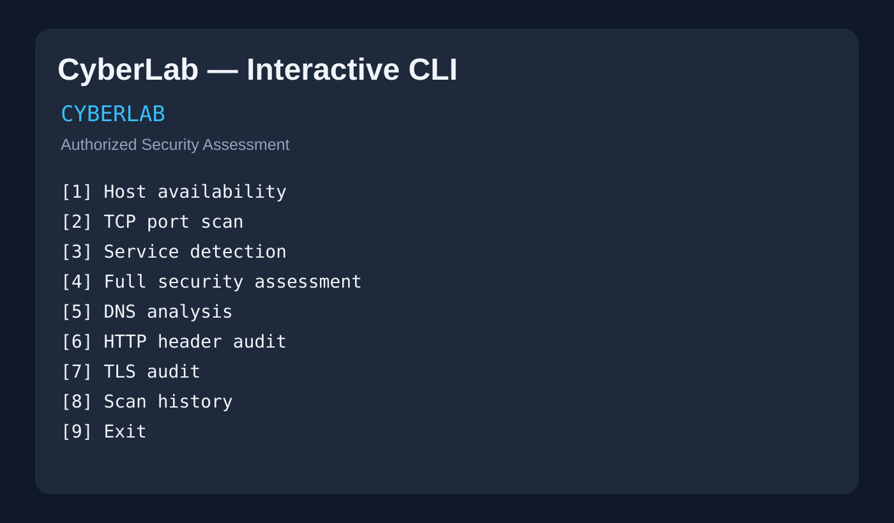
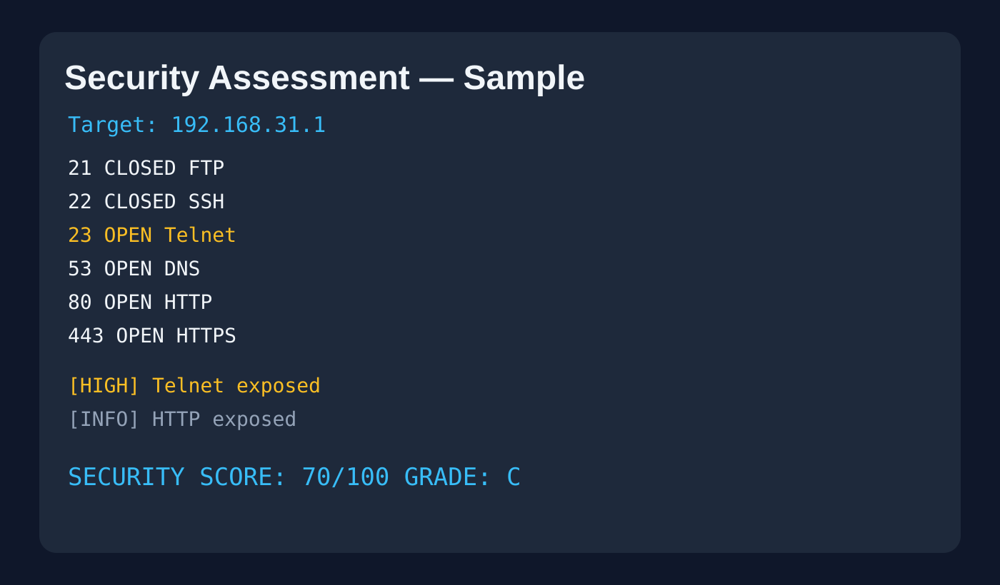
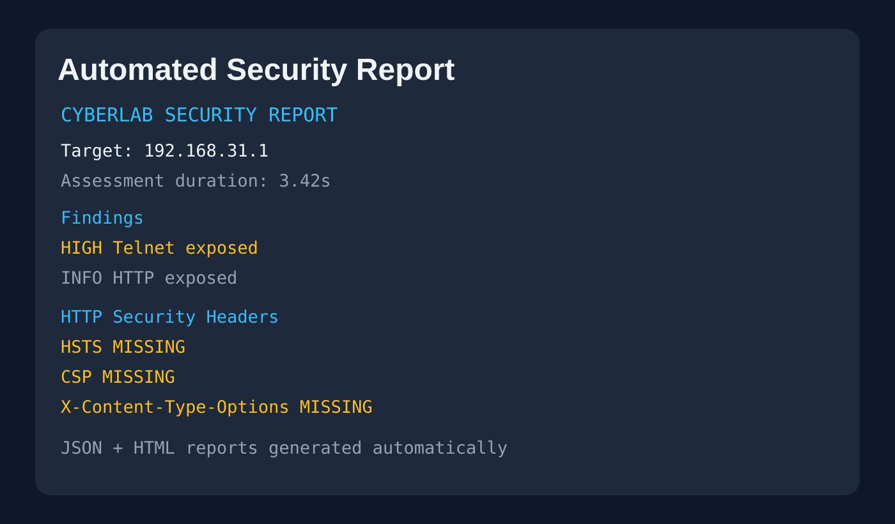

# 🛡️ CyberLab

**Authorized Security Assessment Toolkit built with Python**

CyberLab is a modular, Termux/Linux-friendly cybersecurity project for authorized network assessment. It combines TCP discovery, service detection, DNS analysis, HTTP security-header auditing, TLS inspection, rule-based findings, risk scoring, and automated reporting in one CLI workflow.

> **Ethical use:** Only assess systems and networks you own or have explicit permission to test.

## ⭐ Why recruiters should care

CyberLab demonstrates practical engineering across **Python, networking, cybersecurity, CLI architecture, testing, automation, and security reporting**. It is designed as a portfolio project that produces explainable findings rather than simply running scans.

## 🎬 Project demo

### 1. Professional CLI



### 2. Full security assessment



### 3. Automated reporting



## 🚀 Core capabilities

| Area | Capability |
|---|---|
| Network | TCP port discovery and host availability |
| Enumeration | Service probing and protocol inspection |
| DNS | Resolution analysis |
| Web security | HTTP security-header audit |
| TLS | Protocol/cipher inspection and weak-DH detection |
| Risk | Rule-based findings and transparent scoring |
| Reporting | JSON + HTML security reports |
| History | Persistent scan history |
| Engineering | Modular architecture + unit tests + CI |
| Platform | Standard-library Python, Termux/Linux friendly |

## 🚀 Quick start

```bash
git clone https://github.com/Harsh0675/CyberLab.git
cd CyberLab
python3 cyberlab.py
```

CLI mode:

```bash
python3 cyberlab.py --target 192.168.1.1 --scan
python3 cyberlab.py --target 192.168.1.1 --assess
```

## 🏗️ Architecture

```text
                    ┌─────────────────┐
                    │   cyberlab.py   │
                    │   CLI / Orches. │
                    └────────┬────────┘
                             │
       ┌──────────┬──────────┼──────────┬───────────┐
       ▼          ▼          ▼          ▼           ▼
    Scanner    Services     DNS      HTTP/TLS    Findings
       │          │          │          │           │
       └──────────┴──────────┴──────────┴─────┬─────┘
                                              ▼
                                        Risk Scoring
                                              │
                                    ┌─────────┴─────────┐
                                    ▼                   ▼
                               JSON Report          HTML Report
                                    │
                                    ▼
                               Scan History
```

## 📁 Project structure

```text
CyberLab/
├── core/
├── modules/
│   ├── scanner.py
│   ├── service_detect.py
│   ├── dns.py
│   ├── http_audit.py
│   ├── tls.py
│   ├── findings.py
│   ├── score.py
│   ├── export.py
│   ├── html_report.py
│   └── history.py
├── tests/
├── reports/
├── scans/
├── config/
├── docs/demo/
├── cyberlab.py
├── SECURITY.md
└── README.md
```

## 🧪 Quality & CI

The repository includes Python compilation checks and unit tests. GitHub Actions runs these checks automatically on pushes and pull requests.

Local test:

```bash
python3 -m py_compile cyberlab.py modules/*.py tests/*.py
python3 -m unittest discover -s tests -v
```

## 📊 Example security output

```text
======================================================================
CYBERLAB SECURITY ASSESSMENT
======================================================================
21      CLOSED   ftp
22      CLOSED   ssh
23      OPEN     telnet
53      OPEN     dns
80      OPEN     http
443     OPEN     https
----------------------------------------------------------------------
[HIGH] Telnet exposed (TCP/23)
  Disable Telnet and use SSH instead.

SECURITY SCORE: 70/100  Grade: C

📄 JSON report generated
🌐 HTML report generated
[+] Assessment complete.
```

## 🎯 Skills demonstrated

- Python 3 and standard-library networking
- TCP/IP fundamentals and socket programming
- Service enumeration
- HTTP and TLS security analysis
- DNS resolution
- Risk modelling and scoring
- JSON/HTML report generation
- CLI application architecture
- Unit testing and CI automation
- Linux/Termux development

## 🔐 Responsible security

CyberLab is intentionally focused on **assessment and remediation**, not unauthorized access, credential theft, malware, persistence, or security-control evasion. See [`SECURITY.md`](SECURITY.md) for the responsible-use policy.

## 📌 Portfolio / Resume description

> **CyberLab — Python Cybersecurity Toolkit:** Built a modular authorized security-assessment toolkit implementing TCP discovery, service detection, DNS analysis, HTTP security-header auditing, TLS inspection, transparent risk scoring, automated JSON/HTML reporting, scan history, unit tests, and CI automation.

## 📄 License

Add the license that matches how you want to distribute the project.
